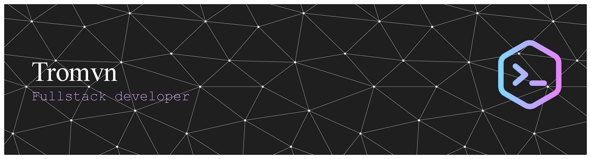

# Hola, aquí Tomás!

- 🛠️​ Desarrollador Full Stack en formación
- ​​🔎​ Interesado en aplicaciones web y nativa y el área DevOps
- 🐧 Fanático del Software Libre y Linux
- 🌱 Actualmente ampliando mi experiencia en proyectos con amigos y propios
- 👯 Buscando colaborar en startups que quieran hacer aportes a la comunidad

 

# 💻 Tech Stack

  

  
  

  

 

**Quiero aprender:** 

---

### Contáctame
   
<!--
**tromvn/tromvn** is a ✨ _special_ ✨ repository because its `README.md` (this file) appears on your GitHub profile.

Here are some ideas to get you started:

- 🔭 I’m currently working on ...
- 🌱 I’m currently learning ...
- 👯 I’m looking to collaborate on ...
- 🤔 I’m looking for help with ...
- 💬 Ask me about ...
- 📫 How to reach me: ...
- 😄 Pronouns: ...
- ⚡ Fun fact: ...
-->
